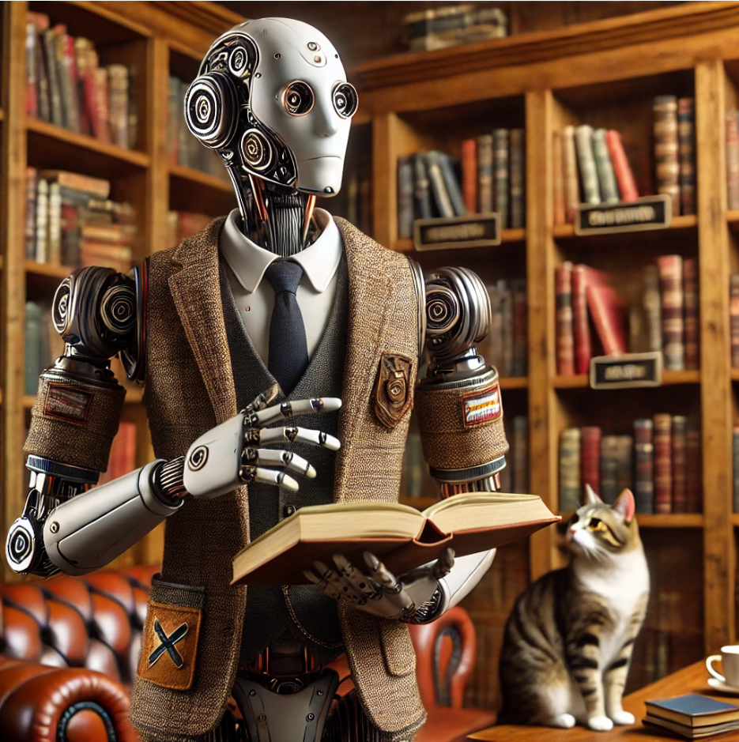

# Textual Futures and Generative AI

### MLA 2025 - Sponsored by the [Electronic Literature Organization](https://eliterature.org/)

### [Session 599](https://mla.confex.com/mla/2025/meetingapp.cgi/Session/20163)

### Saturday, January 11, 2025 - 3:30 PM to 4:45 PM - Hilton Riverside New Orleans - Canal

*Image generated with DALL-E*

**Keywords:** artificial intelligence, electronic literature, software, digital humanities, digital pedagogy

---

As generative AI is becoming more integrated into our word processors and design tools, the lines between computational and human text are blurrier than ever. Speakers explore the future of software-driven composition, considering the implications for authorship, publishing, editing, and scholarly identity. What does it mean to develop critical AI literacy for scholarship? What does this changing digital landscape both make possible and conceal? This roundtable will feature short talks, followed by discussion.

---

## Panelists

### Presiding: Lai-Tze Fan, U of Waterloo

### Speakers

- Kathi Inman Berens, Portland State University
- ~~Kavi Duvvoori, University of Waterloo~~ (unable to attend)
- Dana Gavin, Dutchess Community College
- Alexandre Gefen, Centre National de la Recherche Scientifique
- Anna Ivanov, Harvard University
- Anastasia Salter, University of Central Florida
- Paul Shovlin, Ohio University, Athens

## Abstracts

**How Eliterature Helps Explain AI-Generated Self-Published Books**

In my ongoing work to define parameters and features of populist electronic literature (2019; 2023), I turn my attention to how AI is impacting the massive marketplace of self-published authorship and book selling. Self-published books are the biggest book market in the world. Bowker reports that ISBNs for 2.3 million books were purchased by self-published authors in the US in 2021—and many self-pub books are published without ISBNs. The book data company WordsRated estimates the total number of annually self-published books around 3 million, with 1.7 million being the lowest possible number. By comparison, Penguin Random House, the world’s largest traditional publisher, released 85,000 titles in 2022 (WordsRated 2022).

Self-publishing’s massive market is splintered into thousands of microgenres so specific as to be algorithmic writing--effectively, a form of non-ergodic electronic literature. Microgenres proliferated before AI augmented human ability to output self-published works so fast that Amazon has now limited to three the number of books an author can upload in per day. Traditionally published authors have found pirated “summaries” of their books on Amazon, a fakery they connect to bad actors using AI (Knibbs 2024). Book industry analyst Jane Friedman, describing her own harrowing experience, distinguishes between piracy and AI-produced fake books. She deems the fakery “much worse” than piracy.

This talk will explore the ways in which electronic literature as a decades-long writing practice sheds light on how AI is reshaping self-publishing authorship, fakery, and generic formulation. Historical context will be provided by applying frameworks from key texts that conceptualize the human/computational writing collaboration as “cyborg” writing (Haraway 1985; Hayles 1999, 2008, 2012; Bousquet 2003; Kirschenbaum 2016 and 2023; Cayley and Howe, 2011 and ff., Rettberg 2023).

**Kathi Inman Berens** is Interim Director of the Book Publishing graduate program and Associate Professor of Publishing and Digital Humanities. She served as part of the editorial collective of the *Electronic Literature Collection Volume 4.* Her work at the intersection of digital platforms, creative writing, and publishing has appeared in venues including *Electronic Book Review, Debates in the Digital Humanities 2019, Hyperrhiz: Journal of New Media,* and *Literary and Linguistic Computing*.

---

In “A Case of Identity,” Sherlock Holmes notes, “It is a curious thing [...] that a typewriter has really quite as much individuality as a man’s handwriting. Unless they are quite new, no two of them write exactly alike.” Where Holmes sees differences and individuality in technology and human usage, we in the twenty-first century experience blurriness as generative AI has invaded our writing technologies, often without our consent or awareness. Student writers are often not aware that tools like Grammarly and Microsoft Editor use generative AI, and they do not exercise conscious control over the simultaneously intrusive and occasionally helpful “suggestions.”  We can resist being subsumed by first recognizing the many ways in which our language and writer are impacted by generative AI, especially when it is not overt. 

Considering Marshall McLuhan’s theories of media, and its impact on our conceptions of time, space, and pace, this paper suggests strategies to make writers see the technologies at their fingertips as having marks as unique as Holmes’ observations. Rather than allowing generative AI technologies to quietly dominate our writing, we can and must take control of these “suggestions” and empower student writers to trust their ability to accept and, crucially, reject “suggestions” ruthlessly. In this way, we can more authentically embody Donna Haraway’s concept of the feminist cyborg, rather than being submissive to the intrusions of Silicon Valley’s tech billionaires. 

**Dana Gavin** is the director of the Writing Center at Dutchess Community College and earned her PhD in English from Old Dominion University. She researches the nineteenth-century British print industry, serialized crime fiction, writing center pedagogy, and generative AI. She wrote dance criticism for the Dallas Morning News after graduating from Southern Methodist University with a BA in English and minor in dance, and founded a modern dance company in 2000.

---

**Editorial assistance and narrative standardization**

At a time when literary competitions are inundated with AI-generated texts, we'll be looking at the risks of using AI-supported editorial assistance, which range from censorship to standardization of narrative patterns and situations. Aligning LLMs through supervised learning with moral standards decided by the value systems of the major players in the field is only part of the problem: it corrects only part of the biases and strongly censors everything that makes a novel interesting in terms of contemporary criteria of modernity: negative emotions, a sense of transgression, the unveiling of intimacy and unavowable issues. The representations conveyed by AIs are exposed to an averaging process that makes them less appealing and conveys cultural stereotypes linked to the training of AIs on texts that are predominantly Anglo-Saxon and modern. Beyond the consequences of AI alignment, which pushes authors to use free AIs or older, non-aligned AIs (David Jhave Johnson uses GTP-2), the way in which AIs tend to produce narrative patterns supposedly optimal for the reader's attention and interest runs counter to a conception of art as innovation, rupture, irony of form and play with genres. Behind the promise of democratizing the possibility of writing for oneself and inhabiting personal subjects, collaboration with AI thus exposes the production to a neo-classicism or a stagnation of literary inventiveness. On several occasions, a famous French radio program has used the phrase "C'est écrit par ChatGPT" (It's written by ChatGPT) to devalue a book. This paper explores the strategies adopted by literary players (publishers, authors, critics) in response to this risk, and the attempts made by writers to circumvent algorithmic normativity.

**Alexandre Gefen**, “directeur de recherche” (research professor) at the CNRS, is a historian of ideas and literature. He is the author of numerous articles and essays on contemporary culture and literature and literary theory. He was one of the pioneers of Digital Humanities in France. He is the director of the Culturia IA research project, which focuses on the history and cultural issues of artificial intelligence. Latest books on the subject: *La littérature, une infographie (CNRS éditions*, 2022), *Créativités artificielles* (Les Presses du réel, 2023), *Vivre avec ChatGPT* (L'Observatoire, 2023).

---

**Neural N(et al)?: Dynamics of Co-Authorship and Creation in the Age of AI**

The Ukrainian poet Stanislav Belsky’s Friendly Conversations with Robots (2024) putatively consists of  a poetic dialogue between robots and neural networks, with each poem titled something like “The Robot Aleksandr Writes to the Neural Net Maria,” “The Robot Vadim Remembers,” or “The Neural Net Ulyana Speaks.” In fact, the conversation began earlier, not between neural networks, but between poet and network, as Belsky used his conversations with neural networks and the generated texts of said networks as the basis for these poems. This radical reimagining of authorship leads to both incredibly rich poetic texts and to an examination of the dynamics of authorship and possible co-authorship with and via machines, as well as those of citation, originality, and co-optation in the age of AI. This paper situates Belsky’s text in the context of other Russophone poetic works that imagine the relation between human and machine, arguing that Belsky instantiates a new stage in machine-machine and machine-human(-machine) relations in poetry. Through posthumanism, actor-network theory, and framed against and via the Turing test, this paper presents close readings of several of Belsky’s poems.  Using Belsky’s texts as the basis for a case study, this paper examines the possible implications of poetic (co-)creation in the 2020s and beyond.

**Anna Ivanov** is a PhD candidate in the Department of Slavic Languages and Literatures at
Harvard University, where she is writing a dissertation titled “Network(ed) Russian Poetry:
1820s—2020s.” She received her B.A. in 2018 in Russian Studies, Linguistics, and Data Science
from Macalester College in St. Paul, Minnesota. Her research interests include Russophone
poetry, network and media theories, computational approaches to literature, digital
humanities, posthumanism, artificial intelligences, and new media. Recent conference papers include “Posthuman
Becomings: Nika Skandiaka and Generative Language Models” (AATSEEL 2024), “Network
Poetics, Publics, and Anonymities in Contemporary Russian Poetic Networks (2022-2023)”
(ASEEES 2023) and the roundtables “Computational Formalism: Digital Approaches to
Ukrainian Culture” (AATSEEL 2024) and “Perspectives on Generative AI in Higher Education”
(HILT 2023).

---

**Textual Futures Beyond Walled Gardens**

Drawing on parallels linking our textual futures to textual pasts, this provocation considers the lessons learned from other walled gardens, such as Flash and the Apple App Store. Building on the history of proprietary platforms and designs on the digital literary imaginary, we see the critical need for open-source, preservable work. Universities are rapidly inviting proprietary, black box, generative AI tools into every space of humanities discourse: the classroom, the library, the database, even the schedule. What are the consequences of this rapid transformation to our textual futures?

**Anastasia Salter** is Professor of English and Director of Graduate Programs for the College of Arts and Humanities at the University of Central Florida, and author of eight books including most recently **Playful Pedagogy in the Pandemic** (with Emily Johnson, 2022) and **Twining: Critical and Creative Approaches to Hypertext Narratives** (with Stuart Moulthrop, 2021). Salter is currently Vice President of the international Electronic Literature Organization.

---

**Critical Intersections: The Implications of AI for Teaching, Research, and Scholarly Identities**

53 years ago, Paulo Freire published *Pedagogy of the Oppressed*, the book that launched a thousand ships of critical pedagogy. Scholars such as Richard Ohmann, bell hooks, and Henry Giroux have participated in the liberatory pedagogical project he began. In part, their scrutiny has turned towards the profession of English studies, its scholarship and theory, and more broadly the postivist system at play in the greater university. A little more than one year ago, I began leading faculty learning communities at Ohio University on ChatGPT and other AI and their implications for higher education. I experienced a variety of responses from faculty: excitement, indifference, and hostility and fear. I noticed that colleagues in my own department of English more often than not adopted alarmist views towards LLMs and their students' potential use of them. In this presentation, I argue that such views about ChatGPT may originate from our identities as scholars which are tied to a certain construction of knowledge, a kind of writing, certain writing values. We can look at best practices related to designing writing activities to mitigate the use of AI and establish connections with Freire's alternative to the banking method of education. I argue that changes we will have to make as a result of ChatGPT are an opportunity for us to revise ourselves, our scholarship, and the kind of writing we value.

**Paul Shovlin** is an Associate Professor of Instruction and Director of Composition at Ohio University. In his role he mentors other faculty in this area, and is currently co-facilitator for a faculty learning community on AI and Teaching and Learning in Higher Education.

## Presiding

**Lai-Tze Fan** is the Canada Research Chair in Technology and Social Change and Associate Professor at the University of Waterloo, Canada, as well as Professor 2 at the University of Bergen, Norway. She leads The U&AI Lab at UWaterloo, which intervenes in biased Big Tech design by creating alternative resources and methods for AI, with a focus on enhanced EDI outcomes. Fan is an Editor and the Director of Communications of the open-access journals electronic book review and the digital review. Fan is the Editor of recent special journal issues on research-creation, including 2021’s “Critical Making, Critical Design,” which won the ELO’s 2022 N. Katherine Hayles Prize for Criticism.

**Session Sponsored by the [Electronic Literature Organization](https://eliterature.org/)**

